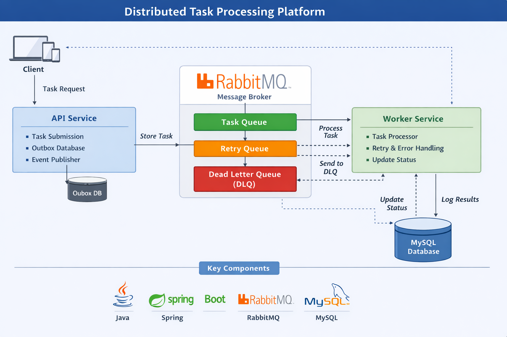

# 🚀 Distributed Task Processing Platform

## 📌 Overview
A **production-grade distributed task processing system** built using **Spring Boot, RabbitMQ, and MySQL**.

This project showcases **event-driven microservices architecture**, focusing on **asynchronous processing, fault tolerance, scalability, and reliable message delivery** using industry-standard design patterns.

---

## 🏗️ System Architecture



### 🔹 API Service
- Handles client task submissions
- Persists tasks in MySQL
- Implements **Outbox Pattern** for reliable event publishing

### 🔹 Worker Service
- Consumes messages from RabbitMQ
- Executes tasks asynchronously
- Handles retries, failures, and logging

### 🔹 RabbitMQ (Message Broker)
- Decouples services via asynchronous messaging
- Supports:
  - Task Queue
  - Retry Queue (TTL-based delay)
  - Dead Letter Queue (DLQ)

---

## 🔄 System Flow

```
Client → API → DB → Outbox → RabbitMQ → Worker → DB
                                      ↓
                                 Retry Queue
                                      ↓
                                    DLQ
```

---

## ⚙️ Features

### ✅ Core Features
- Asynchronous task processing using RabbitMQ
- Microservices-based architecture
- Reliable event publishing via Outbox Pattern

### 🔁 Reliability & Fault Tolerance
- Configurable retry mechanism
- Delayed retries using TTL queues
- Dead Letter Queue (DLQ) for failed processing
- Idempotent processing using DB-level safeguards

### 🌐 API Capabilities
- Create and manage tasks
- Retrieve task by ID
- Pagination support
- Filter tasks by status

### 🛡️ Error Handling
- Centralized exception handling
- Request validation
- Structured API error responses

---

## 📌 Sample API Request

### Create Task
`POST /tasks`

#### Request
```json
{
  "title": "Process Order",
  "description": "Order ID 123"
}
```

#### Response
```json
{
  "id": 1,
  "status": "PENDING"
}
```

---

## 🧪 API Endpoints

| Feature | Endpoint |
|--------|---------|
| Create Task | `POST /tasks` |
| Get Task by ID | `GET /tasks/{id}` |
| Get All Tasks | `GET /tasks` |
| Pagination | `GET /tasks/paged?page=0&size=10` |
| Filter by Status | `GET /tasks/status/{status}` |
| Filter + Pagination | `GET /tasks/status/paged?status=FAILED&page=0&size=10` |

---

## 🔄 Task Lifecycle

```
PENDING → PROCESSING → COMPLETED
                 ↓
              FAILED → RETRY → DLQ
```

---

## 📁 Project Structure

```
api-service/
  └── Handles task submission and persistence

worker-service/
  └── Processes tasks asynchronously

docs/
  └── Contains architecture diagrams

postman/
  └── API collections (optional)
```

---

## 🧠 Design Decisions

- Used **RabbitMQ** for decoupled asynchronous communication
- Implemented **Outbox Pattern** to ensure consistency between DB and messaging
- Used **DLQ** for handling failed messages safely
- Applied **idempotency** to prevent duplicate processing
- Designed system for **horizontal scalability**

---

## 🧰 Tech Stack

- **Language:** Java 21  
- **Backend:** Spring Boot  
- **Database:** MySQL  
- **Messaging:** RabbitMQ  
- **ORM:** Spring Data JPA  
- **Build Tool:** Gradle  

---

## 🚀 Getting Started

### 🔹 Prerequisites
- Java 21+
- MySQL
- RabbitMQ

### 🔹 Run the Application

```bash
# Start API Service
cd api-service
./gradlew bootRun

# Start Worker Service
cd worker-service
./gradlew bootRun
```

---

## 📊 Key Concepts Demonstrated

- Distributed Systems Design
- Event-Driven Architecture
- Outbox Pattern
- Retry & Failure Handling
- Dead Letter Queue (DLQ)
- Idempotent Processing
- Pagination & Filtering
- Exception Handling

---

## 🔮 Future Enhancements

- Docker & Containerization
- API Gateway Integration
- JWT Authentication & Security
- Monitoring (Prometheus, Grafana)
- Database Migration (Flyway)

---

## ⭐ Why This Project Matters

This project reflects **real-world backend engineering practices**:

- Handles **high-scale asynchronous workloads**
- Ensures **data consistency & reliability**
- Demonstrates **microservices communication patterns**
- Designed with **production-grade architecture principles**

---

## 👨‍💻 Author
**Pushpak A. Fasate**
